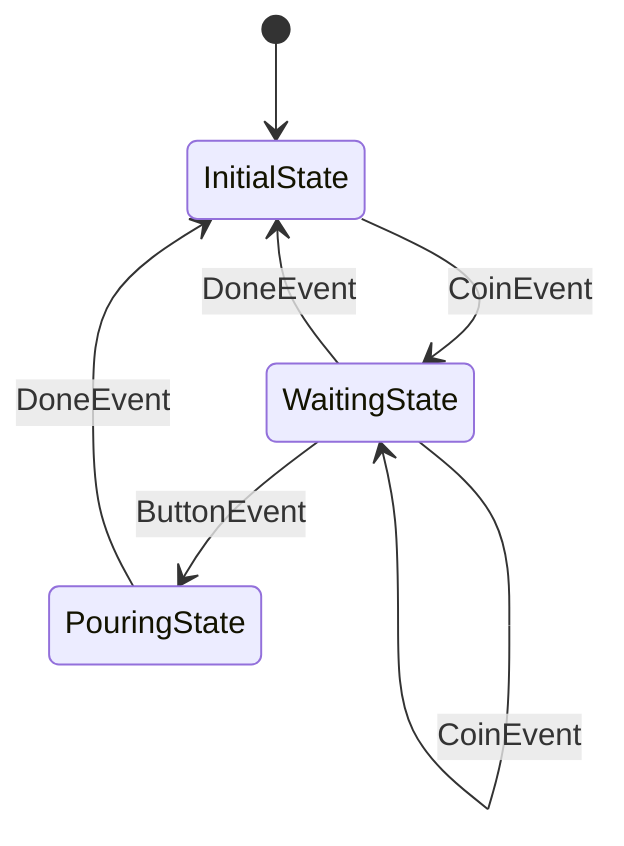

# kazura.js

[ **English** | [日本語](docs/README.ja.md) ]

TypeScript port of [kazura](https://github.com/raiich/kazura) — a library that simplifies difficult stateful application development with asynchronous processing, complex state transitions, and timeouts.

## Problem & Solution

Stateful applications with asynchronous processing, complex state transitions, and timeouts are notoriously difficult to develop correctly.

kazura provides:
- **Serializing async tasks through dispatchers** (eliminating race conditions)
- **Managing state transitions and timeouts in unified machines** (preventing timing issues)
- **Requiring predefined state graphs** (making runtime behavior predictable and debuggable)

This approach makes complex stateful logic simple to implement, test, and extend.

## Features

- **Task serialization** via dispatchers to eliminate race conditions in async processing
- **Unified state machines** that handle both transitions and timeouts consistently
- **Predefined state graphs** for predictable runtime behavior and easy debugging
- **State transition tracing** via pluggable `Tracer` for logging and debugging
- **Virtual time support** for deterministic testing of time-dependent logic
- **Synchronous entry enforcement** to prevent concurrent state transitions

## Installation

```bash
npm install raiich/kazura.js
```

## Quick Start

Let's build a vending machine state machine using kazura. This example demonstrates major features of kazura.

### 1. State Graph Definition

Define states and their transitions first. This makes runtime behavior predictable and debuggable.

```typescript
import { newGraph, on, Machine, Guarded, type State, type EntryMachine } from "kazura/state";
import type { Dispatcher } from "kazura/task";
import { EventLoopDispatcher } from "kazura/task/eventloop";

// Define the state graph
const graph = newGraph<VMState>(
  initial,
  on(CoinEvent, initial, waiting),      // Coin insertion -> waiting
  on(CoinEvent, waiting, waiting),      // Additional coins
  on(DoneEvent, waiting, initial),      // Cancel/timeout
  on(ButtonEvent, waiting, pouring),    // Button press -> pouring
  on(DoneEvent, pouring, initial),      // Pouring complete -> initial
);
```

State diagram:


### 2. State Implementation

Each state defines transition behavior in its `entry` method.

```typescript
// Initial state: machine is idle
class InitialState implements VMState {
  name() { return "InitialState"; }
  entry(machine: EntryMachine<VendingMachine>, event: object): void {
    machine.value().coins = 0;  // Reset coin count
  }
}

// Waiting state: accepts coins and item selection
class WaitingState implements VMState {
  name() { return "WaitingState"; }
  entry(machine: EntryMachine<VendingMachine>, event: object): void {
    const vm = machine.value();

    // Handle coin events
    if (event instanceof CoinEvent) {
      vm.coins++;
    }

    // Guard conditions: conditionally control state transitions
    machine.onExit((_, event) => {
      if (event instanceof ButtonEvent) {
        if (event.item === "coffee" && vm.coins < 2) {
          return new Guarded(`2 coin(s) for ${event.item}, but ${vm.coins}`);
        }
      }
      return null;  // Allow transition
    });

    // Timeout handling: automatically return to initial state after 10 seconds
    machine.afterFunc(vm.dispatcher, 10_000, (m) => {
      m.trigger(new DoneEvent("timeout"));
    });
  }
}

// Pouring state: dispense the selected item
class PouringState implements VMState {
  name() { return "PouringState"; }
  entry(machine: EntryMachine<VendingMachine>, event: object): void {
    // Asynchronous processing: executed after state transition
    machine.afterEntry((m) => {
      m.trigger(new DoneEvent("done"));
    });
  }
}
```

### 3. Events and State Data Definition

```typescript
// Event classes
class CoinEvent {
  constructor(public readonly value: number) {}
}
class ButtonEvent {
  constructor(public readonly item: string) {}
}
class DoneEvent {
  constructor(public readonly reason: string) {}
}
class StartEvent {}

// State data
class VendingMachine {
  coins = 0;
  constructor(public readonly dispatcher: Dispatcher) {}
}

type VMState = State<VendingMachine>;
```

### 4. State Machine Execution

```typescript
// Create event loop dispatcher
const dispatcher = new EventLoopDispatcher(Date.now());

// Create and launch state machine
const vm = new VendingMachine(dispatcher);
const machine = new Machine(graph, vm);
machine.launch(new StartEvent());

// Scenario 1: Buy water (1 coin required)
machine.trigger(new CoinEvent(1));
machine.trigger(new ButtonEvent("water"));

// Scenario 2: Buy coffee (2 coins required)
machine.trigger(new CoinEvent(1));
machine.trigger(new CoinEvent(2));
machine.trigger(new ButtonEvent("coffee"));

// Scenario 3: Insufficient coins for coffee (rejected by guard condition)
machine.trigger(new CoinEvent(1));
const err = machine.trigger(new ButtonEvent("coffee"));  // Returns Guarded

// Scenario 4: Timeout test (using virtual time)
machine.trigger(new CoinEvent(1));
dispatcher.fastForward(Date.now() + 10_000);  // Simulate 10 seconds
```

### 5. Key kazura Features

This example demonstrates the following kazura features:

- **State Graph Definition**: Predefine state transitions with `newGraph`
- **State Transition Control**: Implement transition behavior in each state's `entry` method
- **Guard Conditions**: Control conditional state transitions with `onExit`
- **Timeout Handling**: Time-based automatic transitions with `afterFunc`
- **Asynchronous Processing**: Post-transition async processing with `afterEntry`
- **Event Dispatching**: Event ordering control with `EventLoopDispatcher`
- **State Transition Tracing**: Observe transitions via `Tracer` for logging and debugging
- **Virtual Time**: Time control for testing with `fastForward`

See the code example at [examples/vending-machine](examples/vending-machine/main.ts).

## Packages

- **`state/`** - State machines that unify transitions and timeout handling, eliminating timing issues
- **`task/`** - Dispatchers that serialize async tasks (runtime, eventloop) to prevent race conditions

## Documentation

TODO

## License

See [LICENSE](LICENSE) file.
