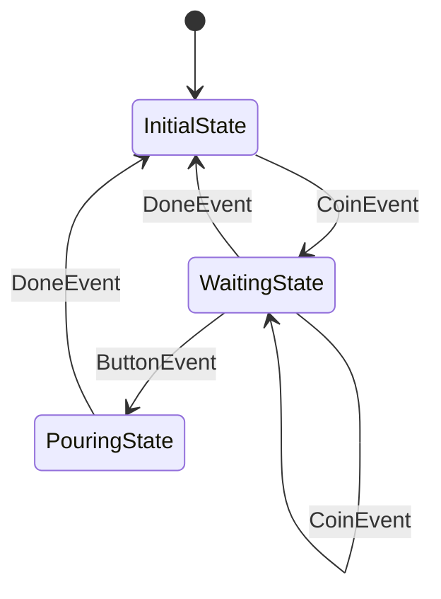

# kazura.js

[ [English](../README.md) | **日本語** ]

[kazura](https://github.com/raiich/kazura)（Go）の TypeScript 移植版です。非同期処理、複雑な状態遷移、タイムアウトを伴う込み入ったステートフルアプリケーション開発を簡単にします。

## 課題と解決策

非同期処理、複雑な状態遷移、タイムアウトを伴うステートフルアプリケーションは、正しく開発することがとても大変です。

kazura は以下を提供します：
- **Dispatcher による非同期タスクの直列化**（競合状態の排除）
- **統一されたマシンでの状態遷移とタイムアウトの管理**（タイミング問題の防止）
- **事前定義された状態グラフの要求**（実行時の動作を予測可能かつデバッグ可能に）

このアプローチにより、複雑なステートフルロジックの実装、テスト、拡張が簡単になります。

## 特徴

- **タスクの直列化** - Dispatcher による非同期処理の競合状態排除
- **統一されたステートマシン** - 状態遷移とタイムアウトを一貫して処理
- **事前定義された状態グラフ** - 予測可能な実行時動作と容易なデバッグ
- **状態遷移のトレース** - プラガブルな `Tracer` によるロギングとデバッグ
- **仮想時間のサポート** - 時間依存ロジックの決定論的テスト
- **同期 entry の強制** - 状態遷移の同時実行を防止

## インストール

```bash
npm install raiich/kazura.js
```

## クイックスタート

kazura を使って自動販売機のステートマシンを構築してみましょう。この例では kazura の主要機能を示します。

### 1. 状態グラフの定義

まず状態とその遷移を定義します。これにより実行時の動作が予測可能でデバッグしやすくなります。

```typescript
import { newGraph, on, Machine, Guarded, type State, type EntryMachine } from "kazura/state";
import type { Dispatcher } from "kazura/task";
import { EventLoopDispatcher } from "kazura/task/eventloop";

// 状態グラフを定義
const graph = newGraph<VMState>(
  initial,
  on(CoinEvent, initial, waiting),      // コイン投入 -> 待機
  on(CoinEvent, waiting, waiting),      // 追加コイン
  on(DoneEvent, waiting, initial),      // キャンセル/タイムアウト
  on(ButtonEvent, waiting, pouring),    // ボタン押下 -> 注ぎ中
  on(DoneEvent, pouring, initial),      // 注ぎ完了 -> 初期状態
);
```

状態図：


### 2. 状態の実装

各状態は `entry` メソッドで遷移時の動作を定義します。

```typescript
// 初期状態：マシンはアイドル状態
class InitialState implements VMState {
  name() { return "InitialState"; }
  entry(machine: EntryMachine<VendingMachine>, event: object): void {
    machine.value().coins = 0;  // コイン数をリセット
  }
}

// 待機状態：コインと商品選択を受け付ける
class WaitingState implements VMState {
  name() { return "WaitingState"; }
  entry(machine: EntryMachine<VendingMachine>, event: object): void {
    const vm = machine.value();

    // コインイベントを処理
    if (event instanceof CoinEvent) {
      vm.coins++;
    }

    // ガード条件：状態遷移を条件付きで制御
    machine.onExit((_, event) => {
      if (event instanceof ButtonEvent) {
        if (event.item === "coffee" && vm.coins < 2) {
          return new Guarded(`2 coin(s) for ${event.item}, but ${vm.coins}`);
        }
      }
      return null;  // 遷移を許可
    });

    // タイムアウト処理：10秒後に自動的に初期状態へ戻る
    machine.afterFunc(vm.dispatcher, 10_000, (m) => {
      m.trigger(new DoneEvent("timeout"));
    });
  }
}

// 注ぎ状態：選択した商品を提供
class PouringState implements VMState {
  name() { return "PouringState"; }
  entry(machine: EntryMachine<VendingMachine>, event: object): void {
    // 非同期処理：状態遷移後に実行
    machine.afterEntry((m) => {
      m.trigger(new DoneEvent("done"));
    });
  }
}
```

### 3. イベントと状態データの定義

```typescript
// イベントクラス
class CoinEvent {
  constructor(public readonly value: number) {}
}
class ButtonEvent {
  constructor(public readonly item: string) {}
}
class DoneEvent {
  constructor(public readonly reason: string) {}
}
class StartEvent {}

// 状態データ
class VendingMachine {
  coins = 0;
  constructor(public readonly dispatcher: Dispatcher) {}
}

type VMState = State<VendingMachine>;
```

### 4. ステートマシンの実行

```typescript
// イベントループの Dispatcher を作成
const dispatcher = new EventLoopDispatcher(Date.now());

// ステートマシンを作成して起動
const vm = new VendingMachine(dispatcher);
const machine = new Machine(graph, vm);
machine.launch(new StartEvent());

// シナリオ1：水を購入（1コイン必要）
machine.trigger(new CoinEvent(1));
machine.trigger(new ButtonEvent("water"));

// シナリオ2：コーヒーを購入（2コイン必要）
machine.trigger(new CoinEvent(1));
machine.trigger(new CoinEvent(2));
machine.trigger(new ButtonEvent("coffee"));

// シナリオ3：コーヒーのコイン不足（ガード条件で拒否）
machine.trigger(new CoinEvent(1));
const err = machine.trigger(new ButtonEvent("coffee"));  // Guarded を返す

// シナリオ4：タイムアウトテスト（仮想時間を使用）
machine.trigger(new CoinEvent(1));
dispatcher.fastForward(Date.now() + 10_000);  // 10秒をシミュレート
```

### 5. kazura の主要機能

この例では以下の kazura の機能を示しています：

- **状態グラフ定義** - `newGraph` で状態遷移を事前定義
- **状態遷移制御** - 各状態の `entry` メソッドで遷移時の動作を実装
- **ガード条件** - `onExit` で条件付き状態遷移を制御
- **タイムアウト処理** - `afterFunc` で時間ベースの自動遷移
- **非同期処理** - `afterEntry` で遷移後の非同期処理
- **イベントディスパッチ** - `EventLoopDispatcher` でイベントの順序制御
- **状態遷移トレース** - `Tracer` でロギングやデバッグ向けに状態遷移を観測
- **仮想時間** - `fastForward` でテスト用の時間制御

コード例は [examples/vending-machine](../examples/vending-machine/main.ts) を参照してください。

## パッケージ

- **`state/`** - 状態遷移とタイムアウト処理を統一し、タイミング問題を排除するステートマシン
- **`task/`** - 非同期タスクを直列化する Dispatcher（queue、eventloop）で競合状態を防止

## ドキュメント

TODO

## ライセンス

[LICENSE](../LICENSE) ファイルを参照してください。
