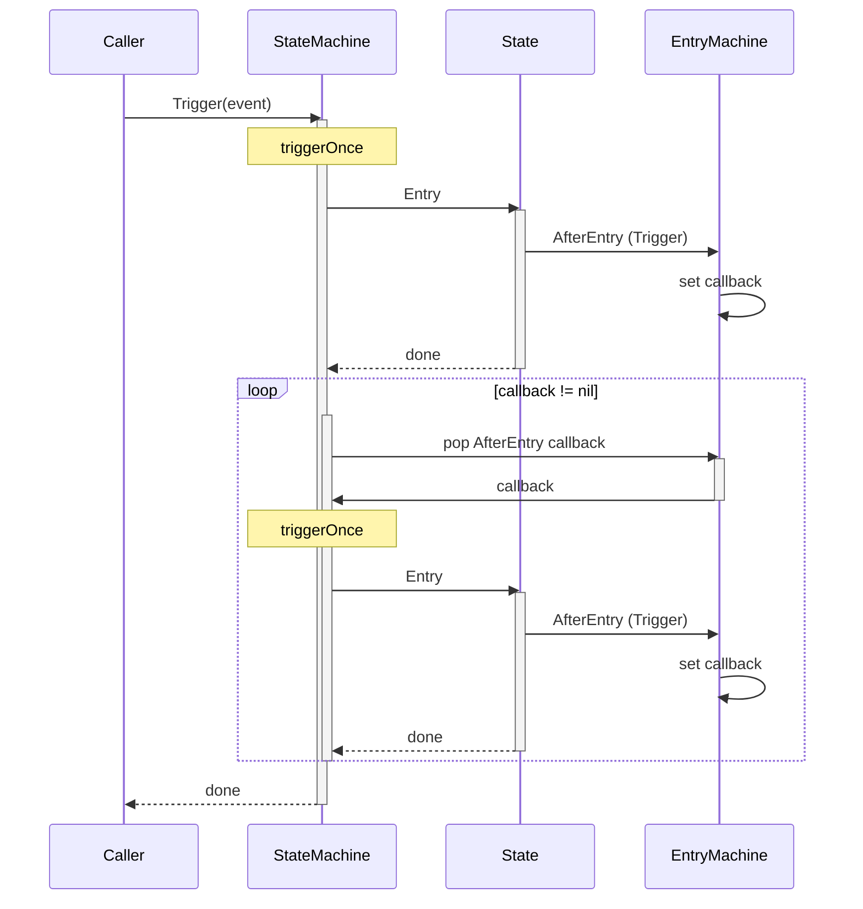

# How the callback registered by AfterEntry is called

```mermaid
sequenceDiagram
    participant a as Caller
    participant m as StateMachine
    participant s as State
    participant ep as EntryMachine

    a ->> m: Trigger(event)
    activate m
    Note over m: triggerOnce

    m ->> s: Entry
    activate s
    s ->> ep: AfterEntry (Trigger)
    ep ->> ep: set callback
    s -->> m: done
    deactivate s

    loop callback != nil
        activate m

        m ->> ep: pop AfterEntry callback
        activate ep
        ep ->> m: callback
        deactivate ep

        Note over m: triggerOnce
        m ->> s: Entry
        activate s
        s ->> ep: AfterEntry (Trigger)
        ep ->> ep: set callback
        s -->> m: done
        deactivate s
    end

    deactivate m
    m -->> a: done
    deactivate m
```
