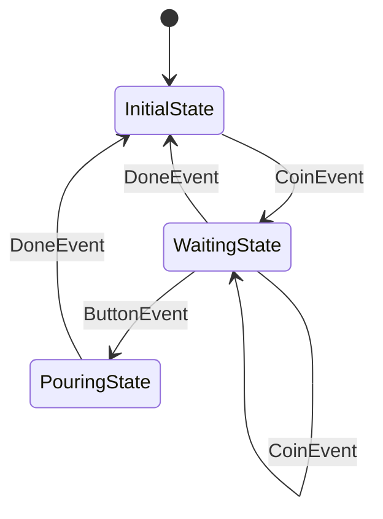

# kazura.js State Machine Best Practices

## Overview

### What is State Machine?

`Machine` is a TypeScript library for implementing Finite State Machines (FSM). By explicitly managing state transitions,
it organizes complex state logic and achieves highly maintainable code.

### Key Benefits

- **Explicit state transitions**: Define transitions as a graph structure, making system behavior visual
- **Testability**: Dispatcher abstraction makes time-dependent processing testable
- **Synchronization guarantees**: Dispatcher's synchronization mechanism ensures safety in concurrent processing

## Basic Usage

### Basic State Definition

All states must implement the `State<T>` interface.

```typescript
import { type State, type EntryMachine } from "kazura/state";

interface VendingMachineData {
  coins: number;
  dispatcher: Dispatcher;
}

class InitialState implements State<VendingMachineData> {
  entry(machine: EntryMachine<VendingMachineData>, event: object): void {
    machine.value().coins = 0;
  }
}

class WaitingState implements State<VendingMachineData> {
  entry(machine: EntryMachine<VendingMachineData>, event: object): void {
    const data = machine.value();

    // Fire a timeout event after 10 seconds
    machine.afterFunc(data.dispatcher, 10_000, (m) => {
      m.trigger(new DoneEvent("timeout"));
    });
  }
}
```

**Key points**:
- `entry` is called every time the state is entered
- `event` is the event that triggered the transition
- Access data via `machine.value()`

### Basic Event Definitions

Events are defined as class instances. Plain objects `{}` cannot be used.

```typescript
// Event without data
class CoinEvent {
  constructor(public readonly amount: number) {}
}

// Event with data
class ButtonEvent {
  constructor(public readonly item: string) {}
}

class DoneEvent {
  constructor(public readonly reason: string) {}
}
```

### Creating a State Graph

Define state transitions as a graph.

```typescript
import { on, newGraph } from "kazura/state";

const stateGraph = newGraph<State<VendingMachineData>>(
  new InitialState(),                                         // Initial state
  on(CoinEvent, new InitialState(), new WaitingState()),      // Coin insert → waiting
  on(CoinEvent, new WaitingState(), new WaitingState()),      // Additional coin while waiting
  on(ButtonEvent, new WaitingState(), new PouringState()),    // Button press → pouring
  on(DoneEvent, new PouringState(), new InitialState()),      // Done → initial
  on(DoneEvent, new WaitingState(), new InitialState()),      // Cancel → initial
);
```

**Key points**:
- First argument is the initial state
- `on(EventClass, from, to)` defines a transition
- Self-transitions (loops) to the same state are possible

### Machine Initialization and Lifecycle

```typescript
import { Machine } from "kazura/state";
import { EventLoopDispatcher } from "kazura/task/eventloop";

// Create a dispatcher
const dispatcher = new EventLoopDispatcher(Date.now());

// Initialize data
const data: VendingMachineData = {
  coins: 0,
  dispatcher,
};

// Create and launch the machine
const machine = new Machine(stateGraph, data);
machine.launch(new StartEvent());

// Trigger events
machine.trigger(new CoinEvent(1));
machine.trigger(new ButtonEvent("water"));

// Stop the machine
machine.stop();
```

**Lifecycle**:
1. `new Machine(graph, data)` - Create machine (not yet launched)
2. `launch(event)` - Transition to initial state, execute entry. `event` is required
3. `trigger(event)` - State transitions via events
4. `stop()` - Cancel all timers and stop

### Wildcard Transitions

Set `from` to `null` to define transitions from any state.

```typescript
const stateGraph = newGraph<State<Data>>(
  new InitialState(),
  on(QuitEvent, null, new InitialState()), // Any state → initial
  // ...
);
```

## State Design

### Define a Common Interface

When adding application-specific methods, extend `State<T>` with a common interface.

```typescript
export interface GameState extends State<GameData> {
  name(): string;
}
```

Using `Machine<GameState, GameData>` uniformly allows different State classes to coexist in the same graph.

### Use the State Pattern for Behavior

Instead of getting `currentState()` externally and branching with `if`, add methods to the common interface and implement them in each State.

```typescript
// BAD: branching externally based on state
if (machine.currentState() === walking) {
  if (key === "Escape") openMenu();
} else if (machine.currentState() === talking) {
  if (key === "Enter") advanceTalk();
}

// GOOD: each State owns its behavior
export interface SceneState extends State<FieldData> {
  handleKey(key: string, trigger: (event: object) => void): void;
}

// Call site
machine.currentState().handleKey(key, (e) => machine.trigger(e));
```

As states grow, the call site stays unchanged, and each State's behavior remains cohesive within its class.

## Timers and Deferred Processing

### Delayed Execution with afterFunc

Use timers to automatically trigger events after a specified duration.

```typescript
class WaitingState implements State<VendingMachineData> {
  entry(machine: EntryMachine<VendingMachineData>, event: object): void {
    const data = machine.value();

    machine.afterFunc(data.dispatcher, 10_000, (m) => {
      m.trigger(new DoneEvent("timeout"));
    });
  }
}
```

**Characteristics**:
- When state transitions occur, timers registered in that state are automatically canceled
- Self-transitions also cancel timers, so there is no risk of timer chain interference
- Synchronization is guaranteed via `Dispatcher`

### Immediate Post-Processing with afterEntry

Register processing to execute immediately after the entry method completes.

```typescript
class PouringState implements State<VendingMachineData> {
  entry(machine: EntryMachine<VendingMachineData>, event: object): void {
    console.log("pouring", (event as ButtonEvent).item);

    machine.afterEntry((m) => {
      m.trigger(new DoneEvent("done"));
    });
  }
}
```

**When to use**:
- When you want to transition to the next state immediately after entry initialization
- Use `afterEntry` because calling `trigger` directly within entry causes re-entry issues

### trigger Rules Inside afterEntry

Inside `afterEntry` callbacks, the ExecutionContext is `AfterEntry`.

**trigger to the same machine**: Use `m.trigger()`.

```typescript
// OK: AfterEntryMachine.trigger() triggers the same machine
machine.afterEntry((m) => {
  m.trigger(new DoneEvent("done"));
});
```

**trigger to another machine**: Call the other machine's `Machine.trigger()` via `m.value()`. The other machine has its own ExecutionContext, so it can be called directly.

```typescript
machine.afterEntry((m) => {
  // OK: sceneMachine is a separate machine with ExecutionContext.None
  m.value().sceneMachine.trigger(new EnterTownEvent(townId));
});
```

## Guard Conditions

### Guards with onExit

Perform validation before leaving a state and block transitions if conditions are not met.

```typescript
class WaitingState implements State<VendingMachineData> {
  entry(machine: EntryMachine<VendingMachineData>, event: object): void {
    const data = machine.value();

    machine.onExit((m, event) => {
      if (event instanceof ButtonEvent) {
        if (event.item === "coffee" && data.coins < 2) {
          return new Guarded(`coffee requires 2 coins, but has ${data.coins}`);
        }
      }
      return null;
    });
  }
}
```

**Key points**:
- `onExit` is registered inside `entry` and executed when leaving the state
- Returning `Guarded` blocks the transition and returns it as an error
- Returning `null` allows the transition

### Do Not Cause Side Effects in Guards

Guards execute before the transaction is committed. Side-effecting logic should be placed in the `entry()` of a self-transition.

## Dispatcher Selection

Choose a Dispatcher based on your use case.

```typescript
// When you want to control time (games, animation, tests)
const dispatcher = new EventLoopDispatcher(Date.now());
dispatcher.fastForward(Date.now()); // Call every frame

// For real-time concurrent processing
const dispatcher = new RuntimeDispatcher();

// When you need pause/resume capability
const base = new EventLoopDispatcher(0);
const dispatcher = new PausableDispatcher(base, () => currentTime);
```

| Dispatcher | Time Control | Execution | Use Case |
|---|---|---|---|
| EventLoopDispatcher | Manual (fastForward) | Caller | Game loops, tests |
| RuntimeDispatcher | Real-time (setTimeout) | Runtime event loop | Web servers, workers |
| PausableDispatcher | Delegated + pause/resume | Delegated to base | Pause menus, modal dialogs |

### PausableDispatcher

`PausableDispatcher` wraps another Dispatcher to add pause/resume capability. When paused, all pending timers are suspended and their remaining times are preserved. On resume, timers are rescheduled with their remaining durations.

```typescript
import { EventLoopDispatcher } from "kazura/task/eventloop";
import { PausableDispatcher } from "kazura/task/pausable";

let currentTime = 0;
const base = new EventLoopDispatcher(0);
const dispatcher = new PausableDispatcher(base, () => currentTime);

// Register a timer via afterFunc (same interface as any Dispatcher)
dispatcher.afterFunc(100, () => {
  console.log("fired");
});

// Advance 30ms, then pause
currentTime = 30;
base.fastForward(30);
dispatcher.pause();   // remaining: 70ms

// Time passes while paused — timer does not fire
currentTime = 200;
base.fastForward(200);

// Resume — timer rescheduled with 70ms remaining
dispatcher.resume();
currentTime = 270;
base.fastForward(270); // fires at 270 (200 + 70)
```

**Characteristics**:
- Implements the `Dispatcher` interface — usable anywhere a Dispatcher is expected, including `machine.afterFunc()`
- `pause()` suspends all tracked timers and records remaining durations
- `resume()` reschedules timers from the current time with their remaining durations
- Timers registered during pause are buffered and scheduled on `resume()`
- `Timer.stop()` works correctly in all states (running, paused, buffered)
- Works with `Manager` state changes — state transitions during pause still cancel associated timers

**Use cases**:
- Pause menu: freeze all game timers while a menu is open
- Modal dialogs: suspend background processing during user interaction
- Focus loss: pause timers when the application loses focus

## Observability

### Tracing State Transitions

Use `Tracer` to observe every state transition from outside the machine.

```typescript
interface Tracer<S> {
  trace(fromState: S | null, toState: S | null, event: object | null): void;
}
```

Pass a `Tracer` implementation when constructing the machine.

```typescript
import type { Tracer } from "kazura/state";

class TransitionLogger implements Tracer<VMState> {
  trace(from: VMState | null, to: VMState | null, event: object | null): void {
    log("transition",
      "from", from?.name() ?? null,
      "to", to?.name() ?? null,
      "event", event);
  }
}

const machine = new Machine(stateGraph, data, { tracer: new TransitionLogger() });
```

**Call Semantics**:
- Called after an exit-action succeeds and before the destination state's `entry` is invoked
- On `launch`, `fromState` and `event` are `null`
- On `stop`, `fromState` is the state the machine was in, `toState` is `null`, and `event` is `null`
- **Not** called when a transition is blocked by a `Guarded` error from an exit-action
- **Not** called for the destination side when `stop` is invoked from within an exit-action (the stop-side trace is still recorded)
- Recorded even if the destination state's `entry` throws — useful for post-mortem debugging
- Invoked synchronously; implementations must not throw and must not block
- Implementations must not mutate the received state or event objects

**Use Cases**:
- Structured transition logging without cluttering `entry` methods
- Generating debug traces or timelines for analysis
- Collecting transition metrics (e.g., transition counts per state pair)

See [examples/vending-machine](../examples/vending-machine/) for a working example.

## Architecture Patterns

### Gateway Class Pattern

When using Machine, the recommended pattern is a **gateway class with data (public) and machine (private)**.

```typescript
class Scene {
  readonly data: SceneData;
  private machine: Machine<SceneState, SceneData>;

  constructor() {
    this.data = { /* ... */ };
    this.machine = new Machine(stateGraph, this.data);
    this.machine.launch(new InitEvent());
  }

  handleKey(key: string): void {
    this.machine.currentState().handleKey(key, (e) => this.machine.trigger(e));
  }
}
```

**Benefits**:
- Encapsulates Machine internals from external access
- Machine operations only through public methods

### Nested State Machines

For complex systems, arrange multiple State Machines hierarchically.

```typescript
// Scene layer
class Scene {
  readonly data: SceneData;
  private machine: Machine<SceneState, SceneData>;
}

interface SceneData {
  character: Character;  // Character layer
  gameData: GameData;
}

// Character layer
class Character {
  readonly data: CharacterData;
  private machine: Machine<CharacterState, CharacterData>;

  ready(): void {
    this.machine.trigger(new StartEvent());
  }

  stop(): void {
    this.machine.trigger(new StopEvent());
  }
}
```

**Key points**:
- Each Machine operates independently and coordinates through method calls
- Machine details are not exposed externally (encapsulation)
- Each Machine can be tested independently

### Model / View Separation

Do not call View (rendering, etc.) directly from the Model layer (machines/). Rendering should be performed externally:

- At the end of `keydown` handlers
- In `afterFunc` callbacks (via Dispatcher wrapper)
- In `afterEntry` callbacks (via Dispatcher wrapper)

## Testing

### Deterministic Tests with EventLoopDispatcher + fastForward

```typescript
const dispatcher = new EventLoopDispatcher(0);
const data: MyData = { dispatcher, /* ... */ };
const machine = new Machine(stateGraph, data);
machine.launch(new InitEvent());

// Advance to absolute times
dispatcher.fastForward(150);  // advance to 150ms
dispatcher.fastForward(300);  // advance to 300ms
```

`fastForward` takes an **absolute time** as its argument (not a delta).

### Testing with PausableDispatcher

```typescript
let currentTime = 0;
const base = new EventLoopDispatcher(0);
const dispatcher = new PausableDispatcher(base, () => currentTime);

// ... setup machine with dispatcher ...

// Advance, pause, resume
currentTime = 50;
base.fastForward(50);
dispatcher.pause();

// Verify timers don't fire while paused
currentTime = 200;
base.fastForward(200);

// Resume and verify remaining time
dispatcher.resume();
currentTime = 200 + remainingMs;
base.fastForward(200 + remainingMs);
```

## Implementation Examples

### Example 1: Vending Machine (vending-machine)

**State Transition Diagram**:


**Features**:
- Guard conditions: Block purchase with insufficient funds
- Timeout: Auto-reset after 10 seconds of inactivity (DoneEvent)
- Self-transition: Additional coins in WaitingState (CoinEvent)

See [vending-machine implementation](../examples/vending-machine/).

## Hints

### Recommended Patterns

1. **Use Gateway Class Pattern**: Encapsulate with data (public) + private `machine`
2. **Define Common Interfaces**: Add application-specific methods to State
3. **Split States into Files/Modules**: Improve readability in large projects
4. **Clarify Responsibilities**: Separate data roles and define state machine scope
5. **Utilize Nested Structures**: Build complex systems through hierarchies
6. **Validate with Guard Conditions**: Prevent invalid state transitions
7. **Use Timers via Dispatcher**: Ensure synchronization safety

### Common Mistakes

1. **Direct trigger inside entry**: Use `afterEntry` instead
2. **Timers without Dispatcher**: Use `machine.afterFunc` instead of `setTimeout`
3. **Forgetting onExit registration**: Register guard conditions inside `entry`
4. **Side effects in Guards**: Guards run before transaction commit. Use self-transition `entry()` for side effects
5. **State explosion**: Address with hierarchical structure (nested Machines)

## When to Use State Machines

- When you have **multiple states with complex transition rules** and need **time-based auto-transitions** (timeouts)
